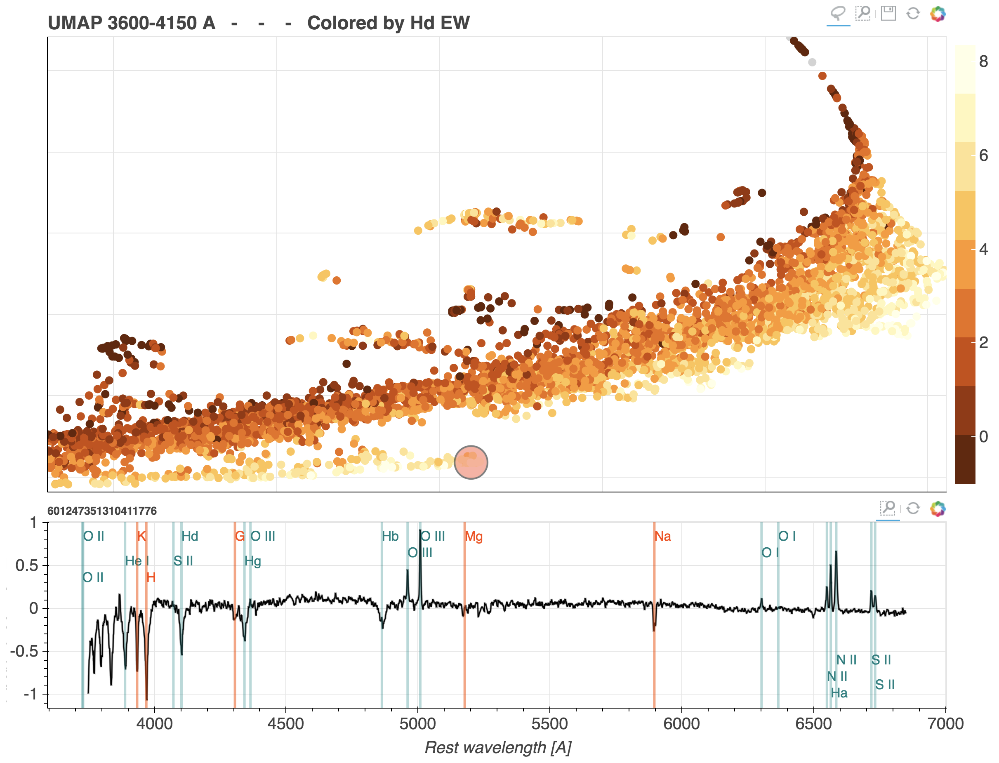

Code for the SDSS galaxies data exploration portal
```
https://galaxyportal.space/
```

Also see
```
https://toast-docs.readthedocs.io/en/latest/
```
for the user manual.

This repository does not contain the data needed to run the portal locally. 
If interested in running the portal for SDSS galaxies or creating a similar portal for any other dataset contact
```
itamarreis@mail.tau.ac.il
```
for help
